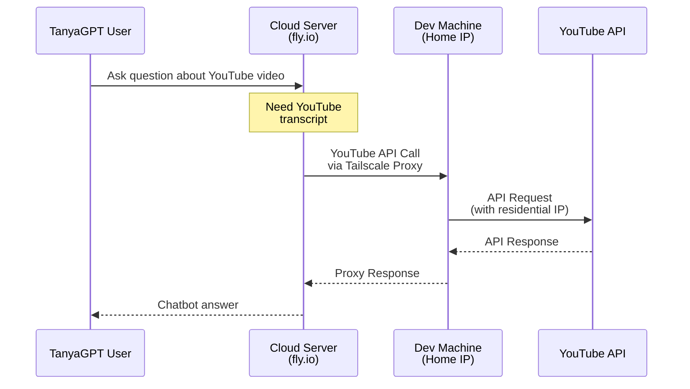

One of the features in [TanyaGPT](https://tanyagpt.my.id/) is to "watch" a YouTube video and answer questions about it. It works by pulling the video transcript as part of the LLM inference.

The problem is, YouTube puts IP blocking on their public API, making the code work in my dev machine but not in the deployed production server that I have in fly.io. This is a common issue when using cloud providers, as their IP ranges are often blocked by services to prevent abuse.

There were some potential solutions for this:
1. The Python library I use, [youtube-transcript-api](https://github.com/jdepoix/youtube-transcript-api) can be used with cookies. But I don't want to risk using my personal Google account cookies. And creating new account for this is a hassle.
2. Buy a residential IP from a proxy service. But I don't want to pay for it, when I only need it for a hobby project.
3. Use Tailscale to create a local network between my dev machine and the production server.

I chose the third option since it is free and sounds fun to explore. This solution leverages [Tailscale](https://tailscale.com/), a zero-config VPN that makes it easy to create secure networks between devices.


## The Architecture



## Configuring Tailscale

On my dev machine that has residential IP, I run the tailscale node. While Tailscale can advertise it as an "Exit node" to route all traffic, I only wanted to proxy YouTube-specific traffic. This is where Tailscale's [app connector](https://tailscale.com/kb/1281/app-connectors) feature comes in handy.

First, I created a new Tailscale app connector for YouTube:


I add the api.ipify.org to the connector to test if the proxy is working, so I can do quick curl check and see my residential IP.

Then on the Tailscale ACL configuration I used:

```json
{
"groups": {
    "group:youtube-admins": ["my-email"],
},
"tagOwners": {
    "tag:youtube-app-connector": [
        "autogroup:members",
    ],
},
"autoApprovers": {
    "routes": {
        "0.0.0.0/0": ["tag:youtube-app-connector"],
        "::/0":      ["tag:youtube-app-connector"],
    },
},
"nodeAttrs": [
    {
        "target": ["*"],
        "app": {
            "tailscale.com/app-connectors": [
                {
                    "name":       "youtube",
                    "connectors": ["tag:youtube-app-connector"],
                    "domains":    ["youtube.com", "*.youtube.com", "api.ipify.org"],
                },
            ],
        },
    },
]
}
```

## Setting Up the Cloud Server

For the cloud server setup, I followed the [Tailscale on Fly.io](https://tailscale.com/kb/1132/flydotio) docs with some modifications. The key steps were:

1. Adding Tailscale to the Dockerfile
2. Configuring the necessary environment variables as Fly.io secrets
3. Implementing an auto-reconnect mechanism

The auto-reconnect was necessary because Fly.io suspends machines during idle periods. Since the node is ephemeral, the Tailscale coordinator delete the machine from the network, causing the machine to unable to reconnect. It was something like this:

```python
@tool
def get_youtube_transcript(video_url: str) -> str:
    if os.environ.get("ENVIRONMENT") == "production":
        subprocess.run(["tailscale", "down"])
        subprocess.run(["tailscale", "up"])
    ...
```

## Performance and Limitations

While this solution works well for my use case, there are some considerations:
- There's added latency due to the traffic routing through the home machine
- The solution depends on the home machine being online
- Periodic reconnections might cause brief service interruptions

All in all, it works reliably for my small-scale needs while keeping costs at zero.
